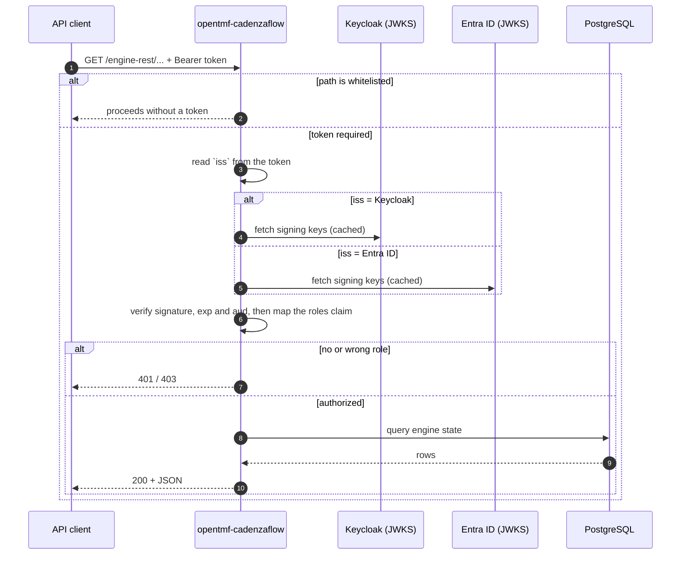
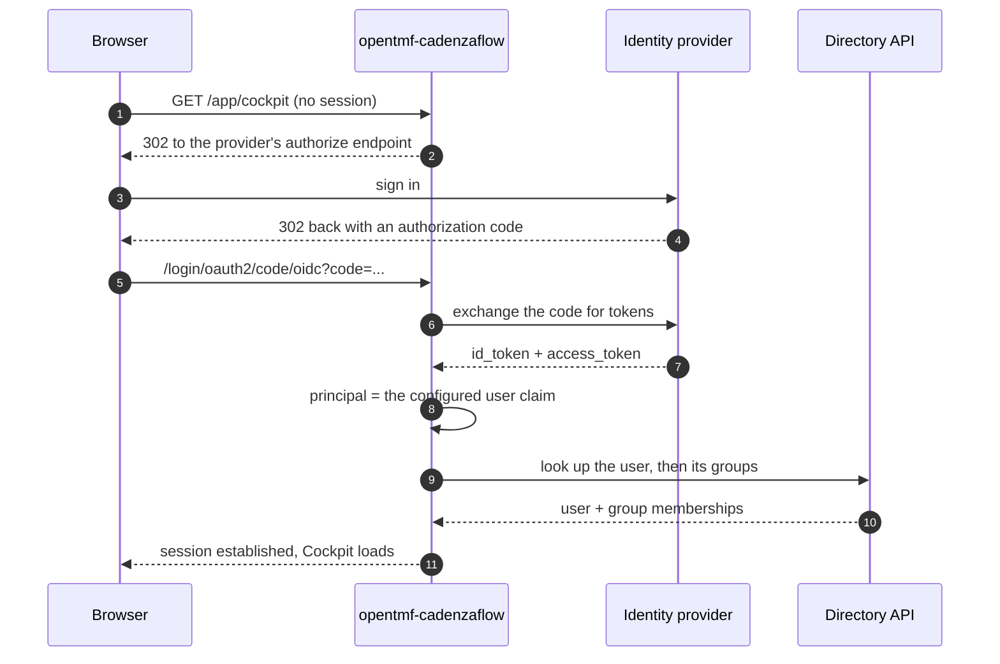
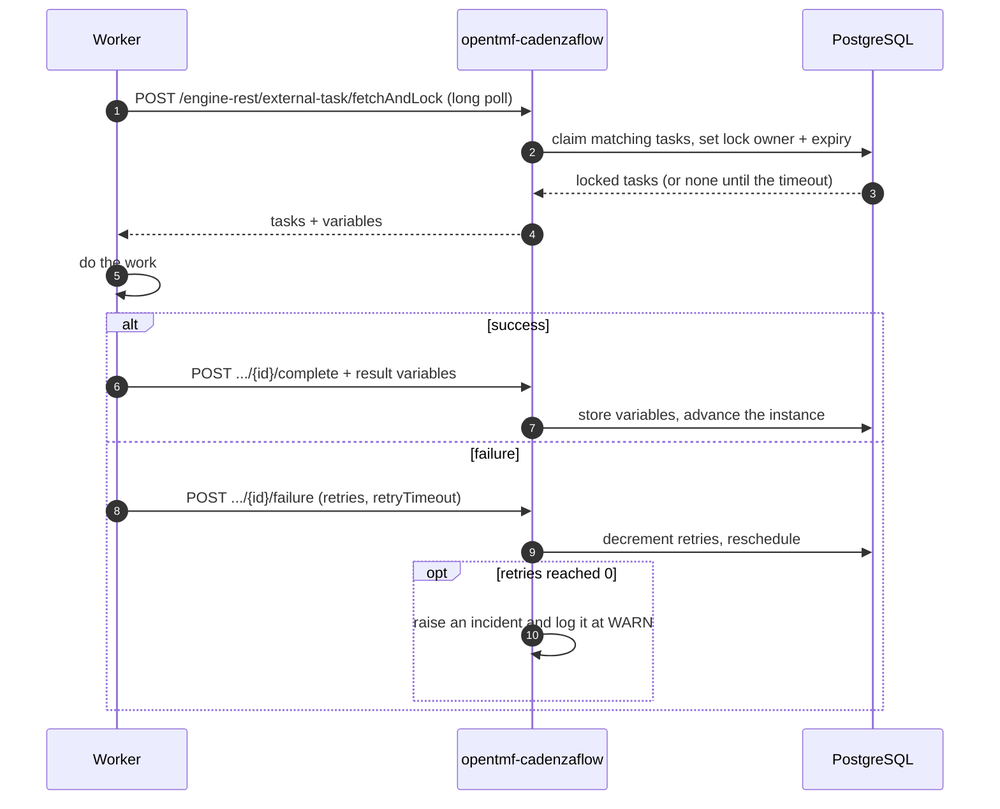
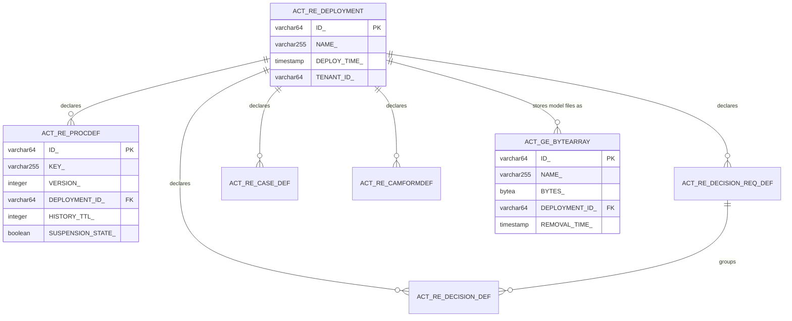
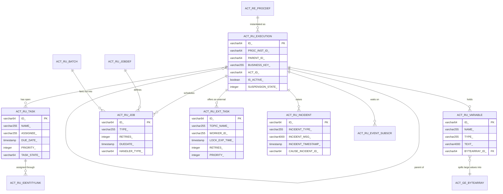
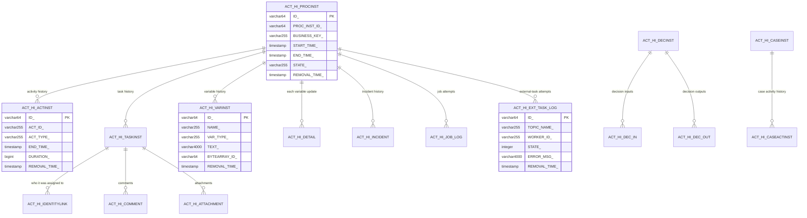
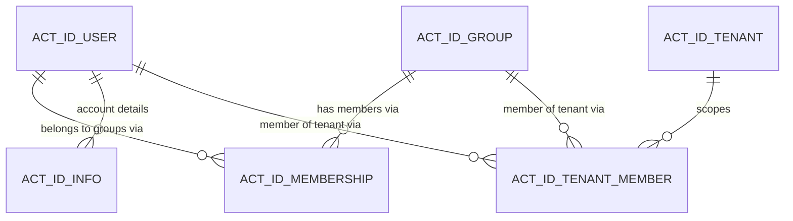

# opentmf-cadenzaflow

A ready-to-run **BPMN workflow engine service**. It packages the
[CadenzaFlow](https://github.com/cadenzaflow/cadenzaflow-bpm-platform) community
edition BPM platform — the maintained Camunda 7 fork — as a Spring Boot
microservice, and adds the three things a platform needs around a bare engine:
**token-based API security**, **single sign-on for the web UIs**, and **users and
groups read from your existing identity provider** instead of a local user table.

You deploy it, point it at a PostgreSQL database and an identity provider, and you
have an engine that runs your BPMN processes, an operations UI, and a REST API your
services can drive.

It is the successor of `opentmf-camunda7`, and its database schema is compatible
with one — pointing this service at an existing Camunda 7 schema is the supported
migration path.

> This document is the front door for **users and testers**: everything needed to
> use the service, and everything needed to write test cases against it, is here.
> The internal design record — module layout, engineering deviations, decision
> history — lives in [docs/component-design-card.md](docs/component-design-card.md).

---

## Contents

- [1. Concepts](#1-concepts)
- [2. Interfaces](#2-interfaces)
- [3. Authentication and access control](#3-authentication-and-access-control)
- [4. Use cases](#4-use-cases)
- [5. Requirements and validation rules](#5-requirements-and-validation-rules)
- [6. Processing logic](#6-processing-logic)
- [7. Data](#7-data)
- [8. Configuration reference](#8-configuration-reference)
- [9. Operating the service](#9-operating-the-service)
- [10. Out of scope](#10-out-of-scope)

---

## 1. Concepts

Five ideas explain almost everything about how this service behaves.

**The engine and its database.** All state — process definitions, running
instances, tasks, variables, history — lives in PostgreSQL, in tables prefixed
`ACT_`. The service is stateless: every pod pointed at the same database is one
engine cluster, and any pod can serve any request.

**Identity provider vs. token validation — two different things.** People often
conflate them; here they are deliberately separate:

| | What it answers | How many are active |
|---|---|---|
| **Identity provider** | "Who are the users and groups, and who is in which group?" — the directory behind task assignment and the Admin UI | **exactly one** (Keycloak *or* Entra ID) |
| **Token validation** | "Is this bearer token genuine, and what roles does it carry?" | **one or several** issuers at the same time |

So a deployment can accept API tokens from two providers while its user directory
comes from one. The engine's plugin contract permits a single identity provider,
which is why that side is not pluralized.

**Lazy directory reads.** Users and groups are fetched from the provider on
demand — when someone logs in, when a task is assigned, when the Admin UI lists
members. Nothing is synchronized into the engine in the background, so there is no
sync lag and no stale local copy to reconcile.

**External tasks.** Business work does not run inside the engine. A BPMN *external
task* is picked up over the REST API by a worker service, which does the work and
reports back. The engine only holds the state machine, so heavy work never competes
with the engine for threads or connections.

**History and its lifetime.** Every finished instance leaves audit rows behind.
Each is stamped with a *removal time* when it ends, and a nightly job deletes what
has expired. Without this the history tables grow forever — so it is on by default.

---

## 2. Interfaces

Two ports. The application port carries everything a caller uses; the management
port carries operational endpoints and is expected to stay internal — never
published through an Ingress.

| URL | What it is | Who may call it |
|---|---|---|
| `:8080/cadenzaflow/v1/engine-rest/**` | The engine REST API: deployments, process definitions and instances, tasks, variables, history, batches | bearer token with a role (§3) |
| `:8080/cadenzaflow/v1/engine-rest/external-task/**` | External-task fetch/lock/complete | **no token by default** — see §3 |
| `:8080/cadenzaflow/v1/app/cockpit` | Cockpit — monitoring and operations UI | browser, SSO login |
| `:8080/cadenzaflow/v1/app/tasklist` | Tasklist — human task UI | browser, SSO login |
| `:8080/cadenzaflow/v1/app/admin` | Admin — users, groups, authorizations | browser, SSO login |
| `:16000/actuator/health/liveness`, `/readiness` | Kubernetes probes | anonymous |
| `:16000/actuator/prometheus` | Prometheus scrape endpoint | anonymous |
| `:16000/actuator/metrics/**`, `/loggers/**` | Metrics; runtime log-level changes | anonymous |
| `:16000/actuator/env` | Effective configuration | bearer token with `admin` |

The normative contract for this service's own surface — the security model, the
whitelisted paths, the management endpoints — is
[docs/openapi.yaml](docs/openapi.yaml). The engine REST API beneath `/engine-rest`
is the upstream CadenzaFlow contract and is not duplicated there.

---

## 3. Authentication and access control

### 3.1 Two ways in

**The REST API** takes a bearer token. The token's signature is checked against the
issuer's published keys, and the roles it carries decide what it may do.

**The web UIs** use OpenID Connect: an unauthenticated browser is redirected to the
identity provider, comes back with a code, and gets a session. There is no local
username/password form and no local user table. Logging out of a UI also ends the
provider session.

### 3.2 Getting a token and calling the API

Keycloak, client-credentials (how a worker or another service authenticates):

```bash
TOKEN=$(curl -s -X POST \
  "$KEYCLOAK/realms/$REALM/protocol/openid-connect/token" \
  -d grant_type=client_credentials \
  -d client_id="$CLIENT_ID" -d client_secret="$CLIENT_SECRET" \
  | jq -r .access_token)

curl -H "Authorization: Bearer $TOKEN" \
  http://localhost:8080/cadenzaflow/v1/engine-rest/process-definition
```

Entra ID, client-credentials:

```bash
TOKEN=$(curl -s -X POST \
  "https://login.microsoftonline.com/$TENANT_ID/oauth2/v2.0/token" \
  -d grant_type=client_credentials \
  -d client_id="$CLIENT_ID" -d client_secret="$CLIENT_SECRET" \
  -d scope="api://$CLIENT_ID/.default" \
  | jq -r .access_token)
```

Starting a process instance:

```bash
curl -X POST -H "Authorization: Bearer $TOKEN" -H 'Content-Type: application/json' \
  http://localhost:8080/cadenzaflow/v1/engine-rest/process-definition/key/my-process/start \
  -d '{"variables":{"orderId":{"value":"A-1001","type":"String"}}}'
```

### 3.3 Access control list

The shipped rules. `roles` are names read from the token's roles/groups claim; a
caller needs **any one** of them.

| Operation | Resource | Roles | Notes |
|---|---|---|---|
| `GET` | `/engine-rest/**` | `reader`, `writer`, `admin` | reading the engine's state |
| `POST` | `/engine-rest/**` | `writer`, `admin` | starting, completing, correlating |
| `PUT` | `/engine-rest/**` | `writer`, `admin` | modifying |
| `DELETE` | `/engine-rest/**` | `writer`, `admin` | deleting instances, deployments |
| any | `/engine-rest/external-task/**` | **none — open** | worker polling; see the warning below |
| any | `/cadenzaflow/**` (the web UIs) | **none at this layer** | the UIs authenticate through SSO themselves |
| `GET` | `/actuator/health`, `/prometheus`, `/metrics/**`, `/loggers/**` | **none — open** | management port, internal only |
| `GET` | `/actuator/env` | `admin` | shows effective configuration |
| any | anything else on the application port | **denied** | unmatched paths are refused, not allowed |

> **The external-task path is deliberately open** so high-frequency worker polling
> costs no token round-trips. This is only safe where the application port is
> reachable by trusted clients alone. If it is not, remove
> `/engine-rest/external-task/**` from the whitelist and give the workers tokens.

Inside the engine there is a **second** authorization layer: engine authorization
(`cadenzaflow.bpm.authorization.enabled`, on by default) decides which users and
groups may see and act on which process instances and tasks. Members of the group
named by `administrator-group-name` (default `camunda-admin`) get full engine
administrator rights. So an API caller passes the endpoint roles above *and* the
engine's own checks.

### 3.4 Role names are configurable

`reader`/`writer`/`admin` are the shipped defaults, not a requirement. Deployments
map them onto whatever their provider issues — see
[§8.5](#85-overriding-endpoint-roles).

---

## 4. Use cases

### 4.1 Web-service driven

| UC ID | Short name | Description | Rel. FR |
|---|---|---|---|
| UC-01 | DeployProcess | A client deploys BPMN/DMN resources to the engine | FR-01 |
| UC-02 | StartInstance | A client starts a process instance, optionally with variables | FR-01 |
| UC-03 | QueryEngineState | A client queries definitions, instances, tasks, variables, history | FR-01 |
| UC-04 | CompleteTask | A client completes or modifies a user task | FR-01 |
| UC-05 | RejectUnauthenticated | A call without a valid token is refused | FR-02, FR-03 |
| UC-06 | RejectUnauthorized | A call with a valid token but no sufficient role is refused | FR-03 |
| UC-07 | AcceptEitherIssuer | Tokens from either configured issuer are accepted on the same endpoints | FR-04 |
| UC-08 | InspectConfiguration | An administrator reads the effective configuration | FR-03 |

### 4.2 Event / message driven

| UC ID | Short name | Description | Rel. FR |
|---|---|---|---|
| UC-10 | FetchAndLockExternalTask | A worker long-polls for external tasks and locks them | FR-05 |
| UC-11 | CompleteExternalTask | A worker reports success and passes result variables back | FR-05 |
| UC-12 | FailExternalTask | A worker reports failure; the engine applies the retry cycle | FR-05, FR-06 |
| UC-13 | LogZeroRetryIncident | An incident with no retries left is written to the log | FR-06 |

### 4.3 Workflow / process driven

| UC ID | Short name | Description | Rel. FR |
|---|---|---|---|
| UC-20 | ExecuteScriptTask | A JavaScript script task is evaluated and its context released | FR-07 |
| UC-21 | RunJobExecutor | Timers, async continuations and retries execute in the background | FR-08 |
| UC-22 | CleanHistory | Expired history is deleted inside the nightly batch window | FR-09 |

### 4.4 Browser driven

| UC ID | Short name | Description | Rel. FR |
|---|---|---|---|
| UC-30 | SsoLogin | An unauthenticated browser is redirected to the provider and returns signed in | FR-10 |
| UC-31 | ResolveUserAndGroups | The signed-in user's identity and group memberships are read from the provider | FR-11 |
| UC-32 | SsoLogout | Logging out of a UI also ends the provider session | FR-10 |

### 4.5 Out of scope / postponed

| Short name | Why |
|---|---|
| LocalUserAdministration | There is no local user store; users and groups belong to the identity provider |
| PasswordLogin | SSO only — the Entra provider has no password flow at all, and the Keycloak one is not used for form login |
| MultipleIdentityProviders | The engine mounts exactly one identity provider; only token validation is multi-issuer |
| BusinessLogicInTheEngine | Work belongs in external-task workers |
| ShippedBpmnModels | The service runs *your* processes; it ships none |

---

## 5. Requirements and validation rules

### 5.1 Functional requirements

| Req. No | Category | Requirement |
|---|---|---|
| FR-01 | Engine | The service exposes the full CadenzaFlow engine REST API under `/engine-rest`, backed by PostgreSQL, and creates or patches its own tables at startup |
| FR-02 | Security | Every application-port request carries a bearer token unless its path is whitelisted; unmatched paths are denied |
| FR-03 | Security | Access is decided per HTTP method and path against the roles in the token |
| FR-04 | Security | The service validates tokens from one issuer, or from several at once, normalizing both onto one internal role vocabulary |
| FR-05 | External tasks | Workers fetch, lock, complete and fail external tasks over REST, with long polling |
| FR-06 | Operability | An incident on a task with zero retries left is logged at WARN |
| FR-07 | Scripting | BPMN script tasks in JavaScript are evaluated, and each evaluation's polyglot context is closed afterwards |
| FR-08 | Engine | A background job executor runs timers, async continuations and retries; it can be disabled per pod |
| FR-09 | Data lifecycle | Finished instances are stamped with a removal time and deleted by a nightly batch job |
| FR-10 | Security | Web UIs authenticate through OpenID Connect; logout ends the provider session |
| FR-11 | Identity | Users and group memberships are read from the configured provider on demand, with no background synchronization |
| FR-12 | Observability | The service publishes engine and JVM metrics on the management port in Prometheus format |

### 5.2 Business validation rules

| Req. No | Short name / ErrorMsg | Condition | Applies to |
|---|---|---|---|
| BVR-01 | `MissingToken` — HTTP 401 | A non-whitelisted application-port request arrives with no bearer token | UC-05 |
| BVR-02 | `InvalidTokenSignature` — HTTP 401 | The token's signature does not verify against the issuer's keys | UC-05 |
| BVR-03 | `UnknownIssuer` — HTTP 401 | In multi-issuer mode, the token's `iss` matches no configured issuer | UC-05, UC-07 |
| BVR-04 | `WrongAudience` — HTTP 401 | An issuer declares expected audiences and the token's `aud` is not among them | UC-05, UC-07 |
| BVR-05 | `ExpiredToken` — HTTP 401 | The token's `exp` has passed | UC-05 |
| BVR-06 | `InsufficientRole` — HTTP 403 | The token is valid but carries none of the roles required for that method and path | UC-06 |
| BVR-07 | `UnmatchedPath` — HTTP 403 | The application-port path matches no whitelist and no rule | UC-05 |
| BVR-08 | `EngineAuthorizationDenied` — HTTP 403 | Endpoint roles pass, but the engine's own authorization refuses the resource | UC-02, UC-03, UC-04 |
| BVR-09 | `AmbiguousTrustConfiguration` — boot failure | Both a single issuer and an issuer list are configured, or an issuer is declared twice | deployment |
| BVR-10 | `UnknownUser` — HTTP 401 at login | The signed-in principal cannot be resolved in the identity provider directory | UC-30, UC-31 |

### 5.3 Out of scope

| Short name | Why |
|---|---|
| `RateLimit` | Throttling belongs to the ingress/gateway layer |
| `PayloadSchemaValidation` | Process variables are opaque to the engine; validation belongs to the workers |

---

## 6. Processing logic

### 6.1 UC-05 / UC-07 — a REST call is authorized

| | |
|---|---|
| **UC ID / Name** | UC-05 RejectUnauthenticated, UC-07 AcceptEitherIssuer |
| **Actors** | API client (worker service, integration, operator script) |
| **Pre-conditions (GIVEN)** | The service is running; at least one issuer is configured; the client holds a bearer token |
| **Trigger (WHEN)** | The client calls any `/engine-rest/**` path |
| **Main flow (THEN)** | The path is checked against the whitelist. If whitelisted, the call proceeds unauthenticated. Otherwise the token is required, its `iss` selects the issuer, the signature is verified against that issuer's keys, `aud` is checked when the issuer declares expected audiences, and the roles claim is read using that issuer's claim mapping. The method and path then select the required role set, and the call proceeds only if the caller holds one of them. Inside the engine, engine authorization is applied to the resource itself. |
| **Post-conditions** | 2xx with the engine's response, or 401 (BVR-01…05), or 403 (BVR-06…08) |
| **Notes** | Both issuers normalize onto one role vocabulary — the rules are written once, never per provider |



### 6.2 UC-30 / UC-31 — a person signs in to Cockpit

| | |
|---|---|
| **UC ID / Name** | UC-30 SsoLogin, UC-31 ResolveUserAndGroups |
| **Actors** | Operator (browser), identity provider, Microsoft Graph or Keycloak Admin API |
| **Pre-conditions (GIVEN)** | The web UIs are enabled; an OIDC client registration exists; the identity-provider plugin has credentials with directory read permission |
| **Trigger (WHEN)** | The operator opens `/cadenzaflow/v1/app/cockpit` without a session |
| **Main flow (THEN)** | The browser is redirected to the provider's authorization endpoint. After signing in it returns with a code, which the service exchanges for tokens. The principal is taken from the configured user claim. The identity provider plugin then resolves that principal to a directory user and reads its group memberships, which become the engine's groups for this session; membership of the administrator group grants engine administrator rights. Cockpit opens. |
| **Post-conditions** | An authenticated session; the operator sees exactly the instances engine authorization permits |
| **Notes** | No local user is created. Logout (UC-32) ends the provider session too |



### 6.3 UC-10 … UC-13 — a worker runs an external task

| | |
|---|---|
| **UC ID / Name** | UC-10 FetchAndLockExternalTask, UC-11 CompleteExternalTask, UC-12 FailExternalTask |
| **Actors** | External-task worker service |
| **Pre-conditions (GIVEN)** | A deployed process reaches an external service task with a topic the worker subscribes to |
| **Trigger (WHEN)** | The worker posts `fetchAndLock` with its topics, a lock duration and an async-response timeout |
| **Main flow (THEN)** | The request parks until work appears or the timeout expires. Returned tasks are locked to that worker for the lock duration. The worker does the work and either completes the task with result variables — the instance moves on — or reports a failure with a retry count and timeout, and the engine reschedules. When retries reach zero an incident is raised, and the service logs it at WARN. |
| **Post-conditions** | The instance advanced, or a retry is pending, or an incident exists |
| **Notes** | Long polling means idle workers cost one parked connection, not a request loop |



### 6.4 UC-22 — history cleanup

| | |
|---|---|
| **UC ID / Name** | UC-22 CleanHistory |
| **Actors** | The engine's job executor (no human) |
| **Pre-conditions (GIVEN)** | A batch window is configured and at least one pod runs the job executor |
| **Trigger (WHEN)** | The clock enters the batch window (default 01:00–05:00 UTC) |
| **Main flow (THEN)** | The cleanup job deletes, in batches, every history entity whose removal time has passed. Removal time is stamped when an instance ends: end time plus the TTL of its process definition, or the global default when the definition declares none. Batch-operation history has its own TTL. Jobs are acquired through the shared database, so pods never duplicate work and the parallelism setting is cluster-wide. |
| **Post-conditions** | Expired `ACT_HI_*` rows are gone; the job is rescheduled |
| **Notes** | Instances that finished *before* a TTL existed carry no removal time and are never cleaned — see §9.4 |

### 6.5 Common — startup trust validation

| | |
|---|---|
| **UC ID / Name** | Common: validate the trust configuration |
| **Pre-conditions (GIVEN)** | The service is starting |
| **Trigger (WHEN)** | Security configuration is bound |
| **Main flow (THEN)** | Exactly one of "a single issuer" or "a list of issuers" must be configured, issuers must be unique, and each issuer must have signing keys. Anything else fails the boot with a message naming the problem. |
| **Post-conditions** | The service either serves with a well-defined trust set, or does not start (BVR-09) |
| **Notes** | Deliberate: a service that silently trusts the wrong issuer is worse than one that will not start |

---

## 7. Data

The service owns no tables of its own. It operates the engine's schema, which the
engine creates at startup from its own DDL scripts — **49 tables**, all of them the
upstream platform's contract rather than this component's design surface.

| | |
|---|---|
| Database | PostgreSQL |
| Schema | `cadenzaflow` (from `SPRING_DATASOURCE_HIKARI_SCHEMA`) |
| Table prefix | the schema qualifier *is* the prefix — table names keep their stock `ACT_` spellings |
| Created by | the engine, when `CADENZAFLOW_BPM_DATABASE_SCHEMA_UPDATE=true` |

**Every column of every table is catalogued in
[docs/database-schema.md](docs/database-schema.md)** — types verbatim from the DDL,
primary keys, the few real foreign keys, unique constraints and indexes. This section
is the map; that file is the territory.

The diagrams below show how the tables relate. Read the relationships as *logical*
ones: the engine maintains most of them itself and only a minority are declared as
database foreign keys, which is deliberate — history has to survive the deletion of
the runtime rows it describes, so **no `ACT_HI_*` table declares a single foreign
key**.

### 7.1 What the five groups are

| Prefix | Tables | What lives there | Lifecycle |
|---|---:|---|---|
| `ACT_GE_*` | 3 | General: the binary store, engine properties, schema log | Written at deploy time and on every large variable |
| `ACT_RE_*` | 6 | Repository: deployed BPMN, DMN, CMMN and form definitions | Appended on deploy, removed only by deleting a deployment |
| `ACT_RU_*` | 16 | Runtime: live, mutable state | Rows exist only while work is in flight — they are **deleted** when an instance ends |
| `ACT_HI_*` | 18 | History: the audit trail | Written as work happens, deleted by TTL-driven history cleanup (§9.4) |
| `ACT_ID_*` | 6 | Identity: engine-local users, groups, tenants | Created but effectively **unused here** — see the note in 7.5 |

> **Why CMMN and DMN tables exist even if you never use them.** The engine creates a
> sub-schema whenever its feature flag is on, and CMMN (`isCmmnEnabled`) and DMN
> (`isDmnEnabled`) both default to on. This deployment does not disable either, so the
> case and decision tables are created regardless of whether any CMMN or DMN model is
> ever deployed. Empty tables cost nothing but they are not evidence of use.

### 7.2 Deployments and definitions — `ACT_RE_*` and `ACT_GE_*`

One deployment carries many definitions, and the model files themselves live as blobs
in `ACT_GE_BYTEARRAY`. `ACT_GE_BYTEARRAY` is also where large variable values go,
which is why it appears again in the runtime diagram.



### 7.3 Live state — `ACT_RU_*`

`ACT_RU_EXECUTION` is the centre of the runtime: one row per process instance plus one
per concurrent path inside it, which is why it points at itself. Everything an operator
troubleshoots hangs off it.

**These rows are transient.** When an instance completes, its execution, task, variable,
job and external-task rows are deleted outright — the record of what happened survives
only in `ACT_HI_*`. An `ACT_RU_*` table that keeps growing is a sign of instances that
never finish, not of history accumulating.



Two runtime tables are not process state at all and are easy to misread:

- **`ACT_RU_METER_LOG`** is the engine's own metrics store. The counters behind
  `cadenzaflow.engine.*` in §9.1 are sums over this table, which is why those meters
  are cumulative and survive a restart.
- **`ACT_RU_AUTHORIZATION`** holds engine-level permissions (§3.3's second layer). It
  is joined into queries only when a request carries an engine authentication — which
  worker traffic on the whitelisted external-task path does not.

### 7.4 History — `ACT_HI_*`

The audit trail, and the only place a finished instance still exists. This is also the
group that grows without bound if cleanup is not working, so it is the one to watch.

**`REMOVAL_TIME_` is what cleanup deletes on.** A `NULL` there means the row will never
be cleaned — that is exactly what §9.4's backfill call exists to repair.



`ACT_HI_OP_LOG` (who changed what through Cockpit or the API) and `ACT_HI_BATCH`
(batch operations) belong to this group too, but hang off users and batches rather
than a process instance.

### 7.5 Identity — `ACT_ID_*`



> **These tables are created but stay empty in a normal deployment.** Users and groups
> are resolved from the identity provider (§3) — Keycloak or Entra ID — through a
> plugin that replaces the engine's identity session, so nothing is written here. They
> exist because the engine's `dbIdentityUsed` flag defaults to on and the plugin does
> not turn it off. Do not treat them as a user store, and do not seed them.

### 7.6 Schema management, and why not Liquibase

`schema-update: true` **creates missing tables. It does not migrate existing ones** —
the engine issues no `ALTER` and makes no version comparison on that path. A restart
after an engine upgrade will therefore not apply new DDL, and a mismatch shows up at
runtime rather than at boot. Set it to `false` to make the engine assert instead: it
then checks the recorded schema version and that every expected table is present, and
needs no DDL rights at all — the right posture when the schema is applied out of band.

**Liquibase is not a usable alternative on CadenzaFlow 1.2.2, despite the changelog
that ships inside the engine jar.** That changelog has had its baseline changeset
removed upstream, so it defines no tables: applied to an empty database it creates the
two Liquibase bookkeeping tables and then fails on the first changeset, which expects
`ACT_GE_SCHEMA_LOG` to already exist. It also stops at a `1.1.0` tag while the engine
is 1.2.2. Adopting it would mean authoring and owning a full changelog ourselves and
keeping it in lockstep with every engine bump — taking ownership of a schema that is
deliberately the upstream platform's contract, and accepting a silent schema/code
mismatch as the failure mode when the two drift.

If the goal is a runtime database user without DDL rights, the cheaper route is to
extract the engine's own `create` scripts from the engine jar
(`org/cadenzaflow/bpm/engine/db/create/activiti.postgres.create.*.sql`), apply them
from a deploy-time job, and run the service with `schema-update: false`. Same benefit,
no new dependency, and the DDL stays the engine's own rather than a copy we maintain.

To adopt an existing `opentmf-camunda7` database, point the datasource at it (e.g.
schema `camunda7`); the schema is compatible.

---

## 8. Configuration reference

Everything is set through environment variables. The tables list the keys worth
knowing; the shipped defaults live in
[application.yml](src/main/resources/application.yml),
[config-cadenzaflow.yml](src/main/resources/config-cadenzaflow.yml) and
[config-security.yml](src/main/resources/config-security.yml).

### 8.1 General

| Variable | Description | Default |
|---|---|---|
| `SPRING_PROFILES_ACTIVE` | Active Spring profiles | — |
| `LOGGING_CONFIG` | Path to your own Logback file | built-in |
| `SERVER_FORWARD_HEADERS_STRATEGY` | Set to `framework` behind a reverse proxy or Ingress, so redirect URLs use the external host | `none` |

### 8.2 Database

| Variable | Description | Default |
|---|---|---|
| `SPRING_DATASOURCE_URL` | JDBC URL | `jdbc:postgresql://postgresql:5432/db?...&currentSchema=cadenzaflow` |
| `SPRING_DATASOURCE_USERNAME` | Database user | `cadenzaflow` |
| `SPRING_DATASOURCE_PASSWORD` | Database password | — |
| `SPRING_DATASOURCE_HIKARI_SCHEMA` | Schema for the engine tables and the pool | `cadenzaflow` |
| `SPRING_DATASOURCE_HIKARI_MAXIMUM_POOL_SIZE` | Connections per pod | `10` |

To adopt an existing `opentmf-camunda7` database, point these at it (e.g. schema
`camunda7`); the schema is compatible.

### 8.3 Identity provider

Pick one with `PLUGIN_IDENTITY_PROVIDER`: `keycloak` (default) or `entra`.

Keycloak:

| Variable | Description | Default |
|---|---|---|
| `PLUGIN_IDENTITY_KEYCLOAK_KEYCLOAK_ISSUER_URL` | Server-to-server realm URL | `http://keycloak.iam-dev.svc.cluster.local/realms/devtest` |
| `PLUGIN_IDENTITY_KEYCLOAK_KEYCLOAK_ADMIN_URL` | Admin REST API URL for the realm | `.../admin/realms/devtest` |
| `PLUGIN_IDENTITY_KEYCLOAK_CLIENT_ID` / `_CLIENT_SECRET` | Credentials for the directory reads | `xxx` |
| `PLUGIN_IDENTITY_KEYCLOAK_USE_EMAIL_AS_CAMUNDA_USER_ID` | Use the mail address as the engine user id | `true` |
| `PLUGIN_IDENTITY_KEYCLOAK_ADMINISTRATOR_GROUP_NAME` | Group granted engine administrator rights | `camunda-admin` |

Entra ID (Azure AD). Needs an app registration with **application** permissions
`User.Read.All` and `GroupMember.Read.All`, admin consent granted:

| Variable | Description | Default |
|---|---|---|
| `PLUGIN_IDENTITY_ENTRA_TENANT_ID` | Directory (tenant) id | — |
| `PLUGIN_IDENTITY_ENTRA_CLIENT_ID` / `_CLIENT_SECRET` | App registration credentials | — |
| `PLUGIN_IDENTITY_ENTRA_USE_EMAIL_AS_CAMUNDA_USER_ID` | Use the mail address as the engine user id | `true` |
| `PLUGIN_IDENTITY_ENTRA_FALLBACK_TO_UPN_WHEN_MAIL_EMPTY` | Fall back to the UPN for members without a mailbox | `true` |
| `PLUGIN_IDENTITY_ENTRA_USE_GROUP_DISPLAY_NAME_AS_CAMUNDA_GROUP_ID` | Group display name becomes the engine group id | `true` |
| `PLUGIN_IDENTITY_ENTRA_TRANSITIVE_GROUP_MEMBERSHIP` | Include nested group membership | `true` |
| `PLUGIN_IDENTITY_ENTRA_SECURITY_GROUPS_ONLY` | Ignore distribution and Microsoft 365 groups | `true` |
| `PLUGIN_IDENTITY_ENTRA_ADMINISTRATOR_GROUP_NAME` | Group granted engine administrator rights | `camunda-admin` |

> For a deployment where Entra ID is the **only** identity provider, everything
> below is already assembled: [`deploy/entra/`](deploy/entra/) has the from-scratch
> tenant setup, a ready-to-fill environment file and Kubernetes manifests.

Entra deployment notes, each of which has cost somebody an afternoon:

- Optional claims are configured **per token type**. Adding `email` to the ID token
  does not add it to the access token; add it to both.
- `requestedAccessTokenVersion` in the app manifest changes **two** things: with
  `2` the issuer is `https://login.microsoftonline.com/{tenant}/v2.0` and the
  audience is the bare client id; with `1` they are
  `https://sts.windows.net/{tenant}/` and `api://{client-id}`. Configure whichever
  your app actually issues.
- Set expected audiences for Entra (§8.4). One tenant mints tokens for many
  applications, so checking only the issuer would accept a token minted for a
  different application in the same tenant.

### 8.4 Token validation

Single issuer — the default, and all a one-provider deployment needs:

| Variable | Description | Default |
|---|---|---|
| `OPENTMF_SECURITY_JWK_SET_URI` | Where the issuer publishes its signing keys | derived from the Keycloak issuer URL |
| `OPENTMF_SECURITY_USER_CLAIM` | Claim used as the caller's identity | `email` |
| `OPENTMF_SECURITY_AUTHORITIES_CLAIM` | Claim carrying roles/groups | `groups` |

Several issuers at once — set these **instead of** `OPENTMF_SECURITY_JWK_SET_URI`
(configuring both fails the boot on purpose):

```yaml
OPENTMF_SECURITY_ISSUERS_0_NAME: keycloak
OPENTMF_SECURITY_ISSUERS_0_ISSUER: https://keycloak.example.com/realms/prod
OPENTMF_SECURITY_ISSUERS_0_JWK_SET_URI: https://keycloak.example.com/realms/prod/protocol/openid-connect/certs
OPENTMF_SECURITY_ISSUERS_0_USER_CLAIM: preferred_username
OPENTMF_SECURITY_ISSUERS_0_AUTHORITIES_CLAIM: groups

OPENTMF_SECURITY_ISSUERS_1_NAME: entra
OPENTMF_SECURITY_ISSUERS_1_ISSUER: https://login.microsoftonline.com/<tenant-id>/v2.0
OPENTMF_SECURITY_ISSUERS_1_JWK_SET_URI: https://login.microsoftonline.com/<tenant-id>/discovery/v2.0/keys
OPENTMF_SECURITY_ISSUERS_1_USER_CLAIM: email
OPENTMF_SECURITY_ISSUERS_1_AUTHORITIES_CLAIM: roles
OPENTMF_SECURITY_ISSUERS_1_AUDIENCES_0: <client-id>
```

The role names in the rules stay the same for every issuer — each issuer's claim
mapping normalizes onto one internal vocabulary.

### 8.5 Overriding endpoint roles

Either as indexed environment variables:

```yaml
OPENTMF_SECURITY_SECURE_ENDPOINTS_0_METHOD: GET
OPENTMF_SECURITY_SECURE_ENDPOINTS_0_PATH: /engine-rest/**
OPENTMF_SECURITY_SECURE_ENDPOINTS_0_ROLES_0: reader
OPENTMF_SECURITY_SECURE_ENDPOINTS_0_ROLES_1: writer
OPENTMF_SECURITY_SECURE_ENDPOINTS_0_ROLES_2: admin
```

…or, more readably, by mounting a file and setting
`SPRING_CONFIG_ADDITIONAL_LOCATION=file:/application/` plus
`SPRING_PROFILES_ACTIVE=test`, with `/application/application-test.yml`:

```yaml
opentmf:
  security:
    secure-endpoints:
      - method: GET
        path: /engine-rest/**
        roles: [reader, writer, admin]
      - method: POST
        path: /engine-rest/**
        roles: [writer, admin]
    management:
      secure-endpoints:
        - method: GET
          path: /actuator/env
          roles: [admin]
```

> **`/actuator/env` has two independent role gates, and they are set in different
> places.** `opentmf.security.management.secure-endpoints` above decides who may
> *reach* the endpoint. Whether the response shows real values or `******` is decided
> separately by Spring Boot, through `management.endpoint.env.roles` (paired with
> `show-values: when_authorized`). A caller who passes the first gate but is not
> named by the second gets a 200 with every value masked — which reads like a broken
> endpoint rather than a permission decision.
>
> Keep the two lists in step. The names in `management.endpoint.env.roles` are
> matched against the caller's granted authorities **exactly as the token spells
> them** — this service maps the roles/groups claim straight to authorities with no
> `ROLE_` prefix added, so `admin` matches an authority named `admin` and nothing
> else. If you rename the roles per §3.4, rename them in both places.

### 8.6 Web UI single sign-on

The client registration id is `oidc` — deliberately not a provider name, because it
is visible to users in `/oauth2/authorization/{id}`.

| Variable | Description |
|---|---|
| `SPRING_SECURITY_OAUTH2_CLIENT_REGISTRATION_OIDC_CLIENT_ID` / `_CLIENT_SECRET` | The browser-flow client |
| `SPRING_SECURITY_OAUTH2_CLIENT_PROVIDER_OIDC_AUTHORIZATION_URI` | Provider authorize endpoint |
| `SPRING_SECURITY_OAUTH2_CLIENT_PROVIDER_OIDC_TOKEN_URI` | Provider token endpoint |
| `SPRING_SECURITY_OAUTH2_CLIENT_PROVIDER_OIDC_JWK_SET_URI` | Provider signing keys |
| `SPRING_SECURITY_OAUTH2_CLIENT_PROVIDER_OIDC_USER_INFO_URI` | Userinfo endpoint (`https://graph.microsoft.com/oidc/userinfo` for Entra) |
| `SPRING_SECURITY_OAUTH2_CLIENT_PROVIDER_OIDC_USER_NAME_ATTRIBUTE` | Claim used as the principal name |
| `KEYCLOAK_URL_AUTH` | The **browser-facing** authorization host. It is also what the UI's content-security-policy allows to be contacted, so it must be set even on an Entra deployment (`https://login.microsoftonline.com`) |

`KEYCLOAK_URL_AUTH` exists separately because the address a browser uses and the
address the pod uses are not always the same (split DNS, Citrix, an external
Ingress). With one reachable address, only the issuer URL needs setting.

### 8.7 Engine behaviour

| Variable | Description | Default |
|---|---|---|
| `CADENZAFLOW_BPM_AUTHORIZATION_ENABLED` | Engine-level authorization | `true` |
| `CADENZAFLOW_BPM_DATABASE_SCHEMA_UPDATE` | Create missing `ACT_*` tables at startup. It **creates, it does not patch**: existing tables are left untouched, so an engine upgrade that ships new DDL needs a deliberate upgrade step. Set `false` to make the engine assert the schema exists and match versions instead, without holding DDL rights | `true` |
| `CADENZAFLOW_BPM_HISTORY_LEVEL` | `full`, `audit`, `activity`, `none`. `activity` drops per-variable history writes — a large insert-load reduction for high throughput installations that audit payloads themselves | `full` |
| `CADENZAFLOW_BPM_JOB_EXECUTION_ENABLED` | Run background jobs on this pod | `true` |
| `CADENZAFLOW_BPM_JOB_EXECUTION_CORE_POOL_SIZE` / `_MAX_POOL_SIZE` | Job executor threads | `3` / `10` |
| `CADENZAFLOW_BPM_JOB_EXECUTION_QUEUE_CAPACITY` | Queue between acquisition and workers | `3` |
| `CADENZAFLOW_BPM_JOB_EXECUTION_MAX_JOBS_PER_ACQUISITION` | Jobs per acquisition round-trip; raise when the acquisition thread becomes the bottleneck | `3` |
| `CADENZAFLOW_BPM_WEBAPP_ENABLED` | Serve the web UIs on this pod | `true` |

> Settings under `generic-properties.properties` (history cleanup times, TTLs) are
> camelCase map keys, and environment variables do **not** map onto them reliably.
> Use a mounted file for those — §9.4 shows one.

### 8.8 Cloud variants

Release builds publish three image flavours; the default carries no cloud jars.

- **`-aws`**: `aws-advanced-jdbc-wrapper` (IAM auth to RDS/Aurora), `awssdk-sts`
  (IRSA on EKS), `aws-msk-iam-auth`. Configure the wrapper as the driver and let
  IAM issue short-lived credentials:

  ```yaml
  spring.datasource:
    url: jdbc:aws-wrapper:postgresql://your-cluster.cluster-xxxx.eu-central-1.rds.amazonaws.com:5432/cadenzaflow
    driver-class-name: software.amazon.jdbc.Driver
    hikari:
      data-source-properties:
        wrapperPlugins: iam
        targetDriverClassName: org.postgresql.Driver
    username: your_iam_db_user
    # no password — the wrapper obtains short-lived tokens via IAM
  ```

- **`-azure`**: `azure-identity-extensions`, for passwordless auth to Azure
  Database for PostgreSQL through Entra ID tokens resolved by
  `DefaultAzureCredential` (AKS Workload Identity, managed identity):

  ```yaml
  spring.datasource:
    url: jdbc:postgresql://<server>.postgres.database.azure.com:5432/db?sslmode=require&authenticationPluginClassName=com.azure.identity.extensions.jdbc.postgresql.AzurePostgresqlAuthenticationPlugin
    username: <managed-identity-or-entra-principal-name>
    # no password
  ```

Infrastructure authentication is independent of the identity provider: any
combination of cloud platform and Keycloak/Entra application identity is valid.

---

## 9. Operating the service

### 9.1 Health and metrics

Probes are `:16000/actuator/health/liveness` and `/readiness`. Prometheus scrapes
`:16000/actuator/prometheus`.

Beyond the standard JVM, HTTP and HikariCP meters that Spring Boot contributes, the
service publishes **thirteen** meters of its own. Nine are cumulative counters read
from the engine's own metrics store (`ACT_RU_METER_LOG`), two are live gauges
queried at scrape time, and two come from the script engine.

Meter names are given here in Micrometer form. Prometheus renames them on the way
out: dots become underscores and counters gain a `_total` suffix, so
`cadenzaflow.engine.job.failed` is scraped as `cadenzaflow_engine_job_failed_total`.

| Meter | Type | Meaning |
|---|---|---|
| `cadenzaflow.engine.root.process.instance.start` | counter | Root process instances started — the engine's unit of billable work, and the closest thing to a throughput number |
| `cadenzaflow.engine.activity.instance.start` | counter | Activity instances entered |
| `cadenzaflow.engine.activity.instance.end` | counter | Activity instances completed. A persistent gap against `.start` means work is entering activities and not leaving them |
| `cadenzaflow.engine.job.successful` | counter | Jobs executed successfully (timers, async continuations) |
| `cadenzaflow.engine.job.failed` | counter | Job executions that threw. Each failure burns a retry; the last one becomes an incident |
| `cadenzaflow.engine.job.acquisition.attempt` | counter | Job-acquisition cycles run by the job executor |
| `cadenzaflow.engine.job.acquired.success` | counter | Jobs successfully locked for execution |
| `cadenzaflow.engine.job.acquired.failure` | counter | Acquisition attempts that lost the optimistic lock — a little is normal with several nodes, a lot means they are fighting over the same jobs |
| `cadenzaflow.engine.job.execution.rejected` | counter | Jobs acquired but refused by the executor because its queue was full — the clearest signal that the job executor is undersized |
| `cadenzaflow.engine.process.instances.active` | gauge | Process instances currently running |
| `cadenzaflow.engine.incidents.open` | gauge | Incidents currently open — **the number to alert on** |
| `opentmf.graaljs.contexts.created` | counter | GraalJS polyglot contexts created for script evaluation |
| `opentmf.graaljs.contexts.closed` | counter | GraalJS contexts closed. In steady state this tracks `.created`; a widening gap is a script-engine leak |

The two gauges each run one bounded `count()` query against the engine per scrape,
so keep the scrape interval sane (15–60s) rather than sub-second. The whole bridge
can be switched off with `CADENZAFLOW_METRICS_ENGINEBRIDGE_ENABLED=false`, which
leaves the JVM and HTTP families in place.

> The engine also keeps its own metrics API at `/engine-rest/metrics`. It reports
> the same underlying counters, but it is JWT-gated and not in Prometheus format;
> the meters above exist so that a scraper needs neither.

### 9.2 Logs

The console is human-readable during development. In a cluster
(`KUBERNETES_SERVICE_HOST` present) the service logs **masked JSON**: fields named
like credentials or personal data (`password`, `client_secret`, `*token*`,
`authorization`, `email`, `iban`, `msisdn`, …) are replaced with `****`, as are
IBANs, German phone numbers and long digit runs found anywhere in a message.

E-mail addresses inside message text are deliberately *not* masked: the engine user
id **is** the mail address, so masking it would erase the actor from every
authorization and task line. Structured `email` fields are masked.

To use your own layout, point `LOGGING_CONFIG` at your file; including
`logback-masking.xml` (shipped in the jar) gives it the same masking with one line.

To see engine request/response bodies, raise
`org.glassfish.jersey.logging.LoggingFeature` to `DEBUG`.

### 9.3 Incidents

When a task's retries reach zero the engine raises an incident and the service logs
it at WARN. Engine behaviour is unchanged — this only makes incidents visible in a
log pipeline. Incidents without an execution (raised during instance migrations)
are intentionally not logged.

### 9.4 History cleanup

On by default. The TTL for an instance resolves in this order:

1. `historyTimeToLive` on the **process definition** (the `camunda:historyTimeToLive`
   attribute in the BPMN, or `PUT /process-definition/{id}/history-time-to-live`).
2. Otherwise the global default, **`P30D`** — 30 days. Change it per deployment
   with a mounted file (see below); a definition that states its own TTL is
   unaffected either way.
3. Batch operations have their own: `batchOperationHistoryTimeToLive`, `P30D`.

Shipped window: 01:00–05:00 (JVM timezone; the image pins UTC), parallelism 2.
Cleanup is cluster-safe — jobs are acquired through the database, so pods never
duplicate work.

Change the schedule with a mounted file, not environment variables:

```yaml
cadenzaflow.bpm:
  generic-properties:
    properties:
      historyCleanupBatchWindowStartTime: "22:00"
      historyCleanupBatchWindowEndTime: "06:00"
      historyCleanupDegreeOfParallelism: 4
```

`"00:00"`–`"00:00"` means continuous; per-weekday windows exist
(`sundayHistoryCleanupBatchWindowStartTime` and friends).

Monitoring and operations, all under `/cadenzaflow/v1/engine-rest`:

| Call | Purpose |
|---|---|
| `GET /history/cleanup/configuration` | The configured batch window |
| `GET /history/cleanup/job` | The scheduled job: next due date, retries, failures |
| `POST /history/cleanup` | Run cleanup now, outside the window |
| `GET /history/cleanup/cleanable-process-instance-report` | Finished vs. cleanable per definition — how much backlog exists |
| `POST /history/process-instance/set-removal-time` | Backfill removal times. Instances that finished **before** a TTL existed carry none and are never cleaned; run this once after introducing TTLs |

### 9.5 Scaling: separate job execution from API traffic

Every pod on one database is one engine cluster, and every pod's job executor
competes for the same jobs. Under load that background work contends with
interactive traffic for the same threads, pool and CPU. Split them by running **two
deployments of the same image against the same database**, differing only in
configuration.

API pods — behind the Service, serving REST and the UIs, running no jobs:

```yaml
CADENZAFLOW_BPM_JOB_EXECUTION_ENABLED: "false"
```

Job pods — in no Service, so they take no HTTP traffic:

```yaml
CADENZAFLOW_BPM_JOB_EXECUTION_ENABLED: "true"
CADENZAFLOW_BPM_WEBAPP_ENABLED: "false"
```

- **At least one pod must run the job executor**, or timers, async continuations,
  retries and history cleanup never run at all.
- The two scale independently. The job-executor knobs matter only on job pods.
- Watch the connection budget: every pod holds its own pool, and the sum across
  both deployments plus every other client must stay under the database's
  `max_connections`.
- Keep business logic in external-task workers; the engine's own jobs then stay
  short and the real work scales in the workers.

### 9.6 Scaling: external-task throughput and `maxTasks`

§9.5 splits the engine. This section is the other half: getting work *through* the
workers. It matters because business logic lives in external-task workers, so worker
throughput — not engine throughput — is usually what a deployment is really tuning.

#### The one thing to understand first

**`maxTasks` is a batch size, not a parallelism setting.** The Java client runs its
topic subscriptions on **a single thread**: it fetches a batch, then invokes your
handler for each task in that batch *one after another*, and only fetches again once
the whole batch is done.

So raising `maxTasks` from 10 to 100 does not make a worker faster. It makes one
thread work through 100 tasks in sequence while the engine holds locks on all 100 —
and locks start counting at fetch time, for the whole batch at once.

> **Concurrency comes from worker *instances*, not from `maxTasks`.**
> To run 20 tasks at once you need 20 client instances (or 20 worker pods), not one
> client with `maxTasks: 20`.

Three failure modes follow directly, and they are the ones seen in practice:

- **A slow task stalls its whole batch.** One task taking 60 s holds up every task
  behind it in the same fetch — and they stay locked the entire time.
- **Lock expiry causes duplicate execution.** If `maxTasks × task duration` exceeds
  `lockDuration`, the tail of every batch loses its lock mid-flight. The engine hands
  those tasks to another worker, so the work runs twice and the original worker's
  `complete` fails. This is self-amplifying: the duplicated work slows things further.
- **Memory.** The fetch response carries each task's variables. `maxTasks ×` payload
  is materialised in the engine's heap and again in the worker's — there is no
  streaming.

#### Client settings

These belong to the worker application, not to this service. With the Spring Boot
external-task client starter they sit under `cadenzaflow.bpm.client`.

| Setting | Default | What to know |
|---|---|---|
| `maxTasks` | `10` | Batch size per fetch. Amortises round-trips; never adds parallelism |
| `lockDuration` | `20000` ms | Lock granted at fetch, for the whole batch. Overridable per topic subscription |
| `asyncResponseTimeout` | *unset* | **Long polling is OFF unless you set this.** Unset means every poll is an immediate round-trip and a database query |
| `usePriority` | `true` | Orders by `PRIORITY_`, which is index-supported |
| backoff | 500 ms → 60 s | Exponential, reset on any non-empty response. Under sustained load it stays at zero wait |

**Always set `asyncResponseTimeout`.** Without it, idle workers poll in a loop and
each poll costs a real query; with it, the request parks server-side and returns as
soon as work appears. The engine caps it at 30 minutes.

One trap: the client sets no HTTP socket timeout of its own, but if you customise the
HTTP client, a socket timeout *shorter* than `asyncResponseTimeout` silently breaks
long polling.

#### Server settings that matter

| Setting | Default | What it does |
|---|---|---|
| `CADENZAFLOW_BPM_RESTAPI_FETCHANDLOCK_QUEUE_CAPACITY` | `200` | How many *newly arriving* long-poll registrations can queue between handler cycles. On overflow the caller gets **HTTP 500 "too many requests at the same time"** |
| `CADENZAFLOW_BPM_RESTAPI_FETCHANDLOCK_UNIQUE_WORKER_REQUEST` | `false` | Cancels a worker's previous parked request when the same `workerId` polls again — useful when a fleet shares worker ids |

There is **no engine-side cap on `maxTasks`**; it becomes a SQL `LIMIT`. The only
guard is the queue above, and it is a burst limiter — the realistic trigger is a whole
worker fleet reconnecting after an engine restart, not steady state.

#### Long polling does not consume server threads

This is the point most deployers get backwards. `fetchAndLock` is handled
asynchronously: a parked request holds **a connection, not a worker thread**. So:

- `server.tomcat.max-connections` (default **8192**) is what limits how many workers
  can be parked at once.
- `server.tomcat.threads.max` (default **200**) limits *active* work — the first
  attempt of each fetch, plus every `complete` and `failure` call. It does **not**
  need to scale with the number of connected workers.

Raising `max-threads` because "we have 500 workers" is the classic wrong move: those
workers are parked, not running. If `tomcat_threads_busy` does track your worker
count, long polling is not actually working — check `asyncResponseTimeout`.

> **With more than one engine pod, expect up to ~30 s pickup latency on long polls.**
> The "work has arrived" signal is in-process only: a task created on pod A does not
> wake a worker parked on pod B. Parked requests re-check on a 30-second sweep, so
> that is the cross-pod worst case. Workers that need faster pickup should either poll
> more eagerly (shorter `asyncResponseTimeout`) or the deployment should accept it.

#### The connection pool is the usual bottleneck

Every fetch tries once **synchronously** on the request thread before parking, and
every `complete`/`failure`/`extendLock` is its own call — so all of them draw from the
Hikari pool. The shipped `maximum-pool-size` is **10** (§8.2), which is fine for light
use and low for real volume: when threads queue for a connection they wait up to
`connection-timeout` (30 s), and meanwhile locks expire — the redelivery storm again,
this time caused by the pool rather than by `maxTasks`.

> **A job pod is under-provisioned at the shipped defaults.** The job executor runs up
> to `max-pool-size` (10) job threads *plus* a separate acquisition thread — 11
> connection consumers against a pool of 10. If you run job pods per §9.5, raise
> `SPRING_DATASOURCE_HIKARI_MAXIMUM_POOL_SIZE` above the job pool size.

#### Starting points

Measure rather than adopt these — they are reasoned starting values, not documented
ones. Every number below is a judgement call; the *mechanisms* above are not.

| Knob | Starting point | Why |
|---|---|---|
| `maxTasks` | 1–5 for slow/IO-bound tasks, 10–50 only for fast uniform ones | The batch is only as quick as its slowest member |
| `lockDuration` | ≈ 3 × (`maxTasks` × p99 task duration), floor 30 s | Headroom for GC pauses, retries and pool waits |
| `asyncResponseTimeout` | 20–30 s | Longer buys little — the cross-pod sweep is 30 s anyway — and interacts badly with ingress idle timeouts |
| Worker parallelism | one client instance per concurrent task | The only real parallelism dimension |
| Hikari pool, API pods | 20–30 | Sized from *active* threads; parked polls cost nothing here |
| Hikari pool, job pods | ≥ job `max-pool-size` + 2 | See the box above |
| Tomcat `threads.max` | leave at 200 | Past the pool size it only deepens the queue in front of Hikari |
| Topic design | many narrow topics | `TOPIC_NAME_` is the only selective index on `ACT_RU_EXT_TASK` — one mega-topic degrades toward a scan |

**Worked example.** 100 tasks/s at 200 ms each needs 100 × 0.2 = **20 concurrent
executions**, so 20 client instances — not one client with `maxTasks: 20`. At
`maxTasks: 10` each client holds a batch ~2 s, so `lockDuration` wants ≈ 30 s, above
the 20 s default. That is 10 fetches/s and 100 completes/s against the pool, and 20
parked connections — nowhere near Tomcat's limits.

#### Reading the symptoms

**Contention between workers is silent.** When several workers race for the same
tasks, the loser does not get an error — the engine quietly drops the conflicting task
from that response. The symptom is **short batches**: you ask for 50 and repeatedly
get 3. That means too many workers chasing too little work, not a fault.

What to watch (§9.1 for the engine meters, the rest are Spring Boot's):

| Signal | Meaning |
|---|---|
| `hikaricp_connections_pending` > 0, acquire time rising | Pool saturated — the clearest external-task saturation signal |
| `hikaricp_connections_timeout_total` rising | Threads hitting the 30 s timeout; expect lock expiry and duplicates |
| `tomcat_threads_busy` near max | Completion rate exceeds thread capacity (should *not* track parked worker count) |
| High request *count* on `fetchAndLock` | Workers getting immediate empty responses — `asyncResponseTimeout` unset or too short |
| HTTP 500 on `fetchAndLock` | The registration queue overflowed; raise its capacity |
| `cadenzaflow.engine.activity.instance.start` − `.end` widening | Work entering activities and not leaving: tasks fetched but not completing |
| `cadenzaflow.engine.incidents.open` rising | Retries exhausted — the alert signal |

> There is **no external-task-specific meter** today: the `job.*` meters describe the
> engine's internal job executor, which is a different path entirely. The activity
> counters above are the closest proxy. Nor is the number of parked workers
> observable.

### 9.7 JavaScript script tasks

Script tasks with `scriptFormat="javascript"` are evaluated by GraalJS (Nashorn is
gone from the JDK). Each evaluation's polyglot context is closed when the
invocation finishes — the stock GraalJS bridge never closes them, which grows the
heap without bound under script-task load.

- Spin helpers such as `S(...)` work: the context stays open across the environment
  scripts and the user script of one invocation.
- Script results that are plain JavaScript objects or arrays are copied into Java
  maps and lists before the context closes.
- **Do not** store a raw JavaScript object with `execution.setVariable(...)`: it is
  serialized after the context has closed. Convert first — `S(JSON.stringify(obj))`
  or a Java type.
- Scripts run **interpreted**. As of GraalVM 25 in-process JIT of JavaScript needs a
  GraalVM JDK, and this image ships Temurin JRE 25. Short BPMN scripts are
  unaffected; JS-heavy workloads want a GraalVM-based image.

### 9.8 Building a local image

```bash
mvn -P docker clean package                       # build + Trivy scan (HIGH/CRITICAL fails)
mvn -Dmaven.test.skip -P docker,aws clean package # the AWS flavour
mvn -Dmaven.test.skip -P docker,azure clean package
```

Or straight from the release Dockerfile:

```bash
docker build -f Dockerfile_release --build-arg MAVEN_PROFILES=repackage,aws \
  -t local/opentmf-cadenzaflow:aws .
```

---

## 10. Out of scope

- **No local user administration.** Users, groups and memberships belong to the
  identity provider. The Admin UI shows them; it does not own them.
- **No password login.** SSO only.
- **No BPMN models.** The service runs the processes you deploy.
- **No business logic.** That belongs in external-task workers.
- **No second identity provider at once.** Token *validation* is multi-issuer; the
  *directory* is single-source by the engine's own contract.
- **No rate limiting or quota enforcement.** That belongs to the ingress layer.

---

## Changelog

See [CHANGELOG.md](CHANGELOG.md).
