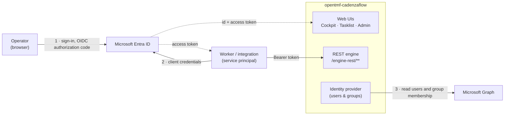

# Deploying opentmf-cadenzaflow with Microsoft Entra ID

A complete, self-contained setup for an environment where **Entra ID is the only
identity provider**: it authenticates the people who use the web UIs, it authorises
the services that call the REST API, and it is the directory the workflow engine
reads its users and groups from. No Keycloak, no local user table.

Everything needed is in this directory:

| File | What it is |
|---|---|
| `README.md` | This guide — the Entra setup and what each setting does |
| `opentmf-cadenzaflow.env` | Every environment variable the service needs, with blanks to fill |
| `kubernetes.yaml` | A worked Secret + Deployment + Service to adapt |

Work through Part 1, fill in Part 2, deploy with Part 3, and confirm with Part 4.
Part 5 is what to check when something does not work.

---

## Where Entra touches the service

Three separate interactions, one app registration. Knowing which one you are
debugging is most of the work.



| # | Surface | What Entra does | Fails as |
|---|---|---|---|
| 1 | **Web UIs** | Signs the operator in and returns tokens to the browser session | a redirect that never completes, or a blocked redirect in the browser |
| 2 | **REST engine** | Issues tokens to callers; the service validates signature, issuer, audience and reads the `roles` claim | `401` (not trusted) or `403` (trusted, no role) |
| 3 | **Identity provider** | Answers *who are the users and groups* over Graph, with the service's own identity | login succeeds but the Admin UI is empty, or admin rights never apply |

The same client id and secret serve all three. Nothing else in the deployment
talks to an identity provider — there is no second issuer and no local user store.

---

## Two mechanisms, and why the distinction matters

The service asks Entra two different questions, and they are answered by two
different features. Confusing them is the single most common source of lost time.

| Question | Answered by | Reaches the service as | Licence |
|---|---|---|---|
| *May this caller do this?* | **App roles** assigned to a user or service principal | the `roles` claim in the token | free — but assigning a role to a **group** needs Entra ID P1/P2 |
| *Who are the users and groups?* | **Microsoft Graph**, read with application permissions | Graph API calls the service makes | free |

So: API authorisation comes from app-role assignment; workflow-engine administrator
rights come from membership of a group the service reads from Graph. On the free
tier you assign app roles to individual users and service principals — group
membership itself works regardless of tier.

---

## Part 1 — Entra ID setup

Do these in order. Every step is in the Entra admin centre
(`entra.microsoft.com`), signed in with an account that can grant admin consent.

### 1.1 Register the application

**App registrations → New registration.**

| Field | Value |
|---|---|
| Name | `opentmf-cadenzaflow` (anything — it is only a label) |
| Supported account types | **Accounts in this organizational directory only** |
| Redirect URI | platform **Web**, `https://<external-host>/cadenzaflow/v1/login/oauth2/code/oidc` |

`<external-host>` is the hostname a **browser** reaches the service on — the Ingress
or load-balancer name, not an in-cluster service name. The path is fixed by the
service: `/cadenzaflow/v1` is its context path, and `login/oauth2/code/oidc` is the
callback, where `oidc` is the client registration id.

Add a second redirect URI for the return from sign-out:
`https://<external-host>/cadenzaflow/v1/app/`. Entra will refuse to honour a
post-logout redirect that is not registered.

From the **Overview** page write down the **Application (client) ID** and the
**Directory (tenant) ID**.

### 1.2 Set the access-token version to 2

**Manage → Manifest.** Find `requestedAccessTokenVersion` and set it to `2`:

```json
"requestedAccessTokenVersion": 2
```

This changes **two** things at once, and both matter later:

| | version 1 (`null` or `1`) | version 2 |
|---|---|---|
| `iss` | `https://sts.windows.net/<tenant>/` | `https://login.microsoftonline.com/<tenant>/v2.0` |
| `aud` | `api://<client-id>` | `<client-id>` (bare) |

The values in Part 2 assume version 2. If you leave it at 1, both the issuer and the
audience settings must change to match — the service validates both, so a mismatch
is a hard 401, not a warning.

### 1.3 Add the `email` claim to both token types

**Manage → Token configuration → Add optional claim.**

Add `email` for **ID** tokens, then repeat and add `email` for **Access** tokens.

Optional claims are configured **per token type** — adding it to the ID token does
not add it to the access token. The service uses the mail address as the workflow
user id, so a missing `email` on the access token surfaces as a 500 on first use,
not as a login failure.

If prompted to turn on the Microsoft Graph `email` permission, accept.

### 1.4 Create the app roles

**Manage → App roles → Create app role**, once per row:

| Display name | Value | Allowed member types | Description |
|---|---|---|---|
| DNMS Read | `dnms-read` | Users/Groups **and** Applications | Read access — `GET /engine-rest/**` |
| DNMS Write | `dnms-write` | Users/Groups **and** Applications | Create and modify — `POST`, `PUT`, `DELETE` |
| DNMS Admin | `dnms-admin` | Users/Groups **and** Applications | Administrative access, incl. `/actuator/env` |
| DNMS PII View | `dnms-pii-view` | **Users/Groups only** | The unmasked customer rendition of rendered documents |

`dnms-pii-view` excludes applications deliberately: views under it are audited with
the operator's own identity, never a service's machine identity, so no service
principal should be able to hold it.

If you edit the **Manifest** instead of using the form, **add to the `appRoles`
array — never replace it.** Entra reads an omitted role as a deletion and refuses
with *"Scope and roles cannot be deleted unless disabled"*. Removing a role
genuinely takes two saves: set `"isEnabled": false` and Save, then delete and Save
again.

### 1.5 Grant the directory-read permissions

**Manage → API permissions → Add a permission → Microsoft Graph → Application
permissions**, and add:

- `User.Read.All`
- `GroupMember.Read.All`

Then **Grant admin consent for &lt;tenant&gt;** and confirm both rows show
*Granted*. Without consent the permissions exist but do nothing, and the service
starts normally and fails only when it first reads the directory.

These are **Application** permissions, not Delegated: the service reads the
directory with its own identity, in the background, not on behalf of a signed-in
user.

### 1.6 Create the administrator group

**Groups → New group**, type **Security**, name `camunda-admin`. Add whoever should
hold workflow-engine administrator rights.

The name is configurable (`PLUGIN_IDENTITY_ENTRA_ADMINISTRATOR_GROUP_NAME`); the
mechanism is not — members of this group get engine administrator authorisations,
resolved from Graph at sign-in. This is group **membership**, so it needs no app
role assignment and no premium licence.

### 1.7 Assign the app roles

**Enterprise applications → `opentmf-cadenzaflow` → Users and groups → Add
user/group.** Assign each person the roles they need.

For a **service** that calls the REST API (an external-task worker, an
integration), the assignment goes on its **service principal**, which the portal
cannot do — use Graph, or have the calling application's own registration request
these app roles as application permissions and grant admin consent.

> **There is no `roles` claim at all without an assignment** — not an empty one.
> Every call is then a 403, which looks like a broken configuration and is not one.

### 1.8 Create the client secret

**Manage → Certificates & secrets → New client secret.** Copy the **Value**
immediately — it is shown once. The **Secret ID** beside it is *not* the secret;
using it produces `AADSTS7000215: Invalid client secret provided`.

Record its expiry. When it rotates, update the deployment secret; nothing else
changes.

---

## Part 2 — The values you now have

| Value | Where you got it | Used as |
|---|---|---|
| Directory (tenant) ID | 1.1, Overview | `ENTRA_TENANT_ID` |
| Application (client) ID | 1.1, Overview | `ENTRA_CLIENT_ID` |
| Client secret **Value** | 1.8 | `ENTRA_CLIENT_SECRET` |
| External host | your Ingress | `EXTERNAL_HOST` |
| Database URL, user, password | your platform | `SPRING_DATASOURCE_*` |

Fill these into `opentmf-cadenzaflow.env`. Every other line in that file is already
correct for an Entra-only deployment and carries a comment explaining what it does.

---

## Part 3 — Deploying

`kubernetes.yaml` is a worked example: a Secret for the three sensitive values, a
Deployment that reads the rest from a ConfigMap, and a Service. Adapt the image
reference, resources and Ingress to your platform.

Two settings that are easy to miss and both break sign-in:

- **`SERVER_FORWARD_HEADERS_STRATEGY=framework`** — behind an Ingress or load
  balancer, the service otherwise builds redirect URLs from the internal address and
  Entra rejects them as unregistered.
- **`KEYCLOAK_URL_AUTH=https://login.microsoftonline.com`** — a historically-named
  key that is simply *the browser-facing authorization host for whichever provider
  is configured*. It is also what the web UI's content-security-policy permits the
  browser to contact, so leaving it at its default blocks the sign-in redirect in
  the browser with no server-side error at all.

---

## Part 4 — Verifying, in order

Each check proves one thing. Run them in sequence; a failure tells you exactly which
part of the setup is wrong.

**1. The service is up**

```bash
curl -fsS https://<external-host>/actuator/health/readiness    # management port 16000
```

**2. A token can be obtained** (client credentials — proves 1.1 and 1.8)

```bash
TOKEN=$(curl -s -X POST \
  "https://login.microsoftonline.com/$TENANT_ID/oauth2/v2.0/token" \
  -d grant_type=client_credentials \
  -d client_id="$CLIENT_ID" -d client_secret="$CLIENT_SECRET" \
  -d scope="api://$CLIENT_ID/.default" | jq -r .access_token)
```

**3. The token carries what the service needs** (proves 1.2, 1.3 and 1.7)

```bash
echo "$TOKEN" | cut -d. -f2 | base64 -d 2>/dev/null | jq '{iss, aud, roles, email}'
```

Expect `iss` ending in `/v2.0`, `aud` equal to the bare client id, and a `roles`
array. **An absent `roles` key means step 1.7 was not done for this principal.**

**4. The API accepts it**

```bash
curl -fsS -H "Authorization: Bearer $TOKEN" \
  https://<external-host>/cadenzaflow/v1/engine-rest/process-definition
```

`401` → the token is not trusted (issuer, audience or signature — check 1.2).
`403` → the token is trusted but carries no sufficient role (check 1.7).

**5. Sign-in works and the directory is readable**

Open `https://<external-host>/cadenzaflow/v1/app/cockpit` in a **private browsing
window** — a normal window may silently reuse an existing session for a different
account. Sign in. Then open **Admin → Users**: seeing directory users proves the
Graph permissions from 1.5 are consented and working.

---

## Part 5 — When it does not work

| Symptom | Cause | Fix |
|---|---|---|
| `AADSTS7000215: Invalid client secret provided` | The **Secret ID** was copied instead of the secret **Value** | Create a new secret; copy the Value column |
| `AADSTS50055: user_password_expired` | An administrator-set password is temporary by design | Sign in interactively once and change it |
| Every API call returns **403** | The principal holds no app role, so the token has no `roles` claim | Assign roles — 1.7 |
| Every API call returns **401** | Issuer or audience mismatch | Decode the token (Part 4 step 3); if `iss` contains `sts.windows.net`, set `requestedAccessTokenVersion: 2` — 1.2 |
| **500** `Attribute value for 'email' cannot be null` | The `email` claim is missing from the **access** token, or the signed-in account has no mailbox | Add `email` to Access tokens — 1.3. For mailbox-less accounts (guests, `#EXT#`) the UPN fallback covers it |
| Sign-in redirect is blocked in the browser, nothing in the server log | `KEYCLOAK_URL_AUTH` still points at its default, so the page's content-security-policy forbids contacting Entra | Set it to `https://login.microsoftonline.com` |
| Entra reports an unregistered reply URL | The service built the redirect from its internal address | Set `SERVER_FORWARD_HEADERS_STRATEGY=framework` |
| Sign-in lands on the wrong account | The browser reused an existing Microsoft session | Private window, or *Use another account* |
| Directory reads fail after a clean start-up | Permissions added but consent never granted | **Grant admin consent** — 1.5 |
| A user has more than ~200 groups | Entra replaces the groups claim with an overage link | Not an issue here — group membership is read from Graph, not from the token |

---

## What this deployment does **not** need

- **No Keycloak**, and no `PLUGIN_IDENTITY_KEYCLOAK_*` settings. The engine mounts
  exactly one identity provider.
- **No local users.** The Admin UI shows the directory; it does not own it, and
  users cannot be created there.
- **No password login.** Sign-in is redirect-based only.
- **No app-role assignment for engine administrator rights** — that comes from
  membership of the `camunda-admin` group (1.6).
